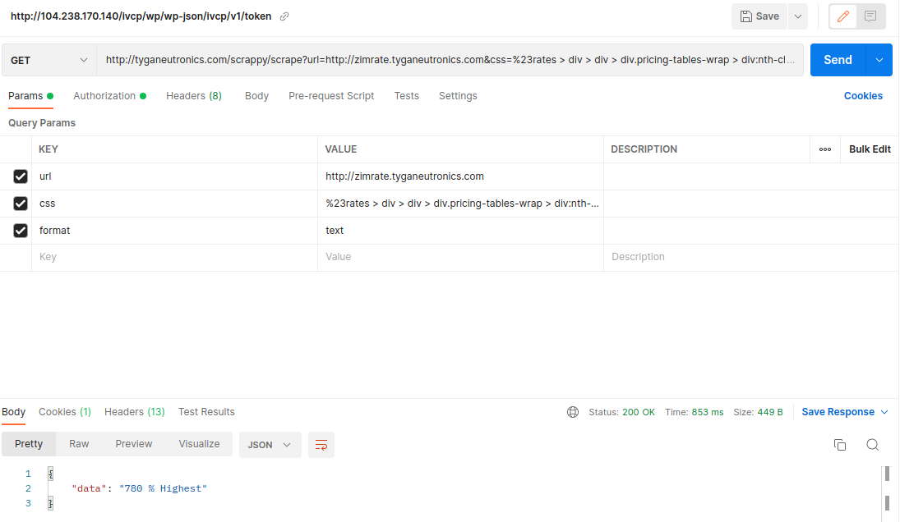

# Scrappy

A php based web scrapper exposing a rest api. [scrappy](https://scrappy.tyganeutronics.com/api)



---
Ever wanted to just get just three letters from a website, maybe just for watching a websites' content count and
implementing a full web scraper would be over kill? Well that's what scrappy is for. Just provide a url, css/xpath
selector and get the content of first matched element.

### Usage

For example getting specific rate from http://zimrate.tyganeutronics.com using wget

```shell
wget --no-check-certificate --quiet \
  --method POST \
  --timeout=0 \
  --header 'Authorization: Bearer {{YOUR-TOKEN}}' \
   'https://scrappy.tyganeutronics.com/api/scrape?url=https://zimrate.tyganeutronics.com&selector=%23rates > div > div > div.pricing-tables-wrap > div:nth-child(5) > div > div > div:nth-child(2) > div&format=html'
```

##### Breakdown

###### Endpoint

http://your-install/api/scrape

###### Post or Get

1. URL: `http://zimrate.tyganeutronics.com`
    - Page to scrape
2. selector:
    - Selectors to filter out unwanted content, with either of the below listed options
        - css:
      ```css
      #rates > div > div > div.pricing-tables-wrap > div:nth-child(5) > div > div > div:nth-child(2) > div
      ```
        - xpath:
      ```xpath
      .//*[@id="rates"]/div/div/div[contains(concat(" ",normalize-space(@class)," ")," pricing-tables-wrap ")]/div[(count(preceding-sibling::*)+1) = 5]/div/div/div[(count(preceding-sibling::*)+1) = 2]/div/span[contains(concat(" ",normalize-space(@class)," ")," pricing-table-price-amount ")][contains(concat(" ",normalize-space(@class)," ")," h1 ")]
      ```
3. format:

    - The format to return the data in
        - html: Will just return the html of first matching element.
        - text: Will return the text (html striped) of first matching element.

###### Headers

1. Authorization: Bearer

- Just a token to reduce abuse of the api. Can easily be created using the below details

```shell
wget --no-check-certificate --quiet \
  --method GET \
  --timeout=0 \
  --header '' \
   'https://scrappy.tyganeutronics.com/api/auth?email=tygalive@gmail.com'
```

##### Breakdown

###### Endpoint

http://your-install//api/auth

###### Post or Get

1. email:

- Your email to generate a token
- No security is enforced, just a mechanism to control abuse

### Installation

1. `echo "Cloning" && git clone https://github.com/richard-muvirimi/php-scrappy -C scrappy`
2. `echo "Change to working directory" && cg scrappy`
3. Create a .env based on the env provided
4. `echo "Setting up" && composer install && php artisan migrate`

### License

MIT
